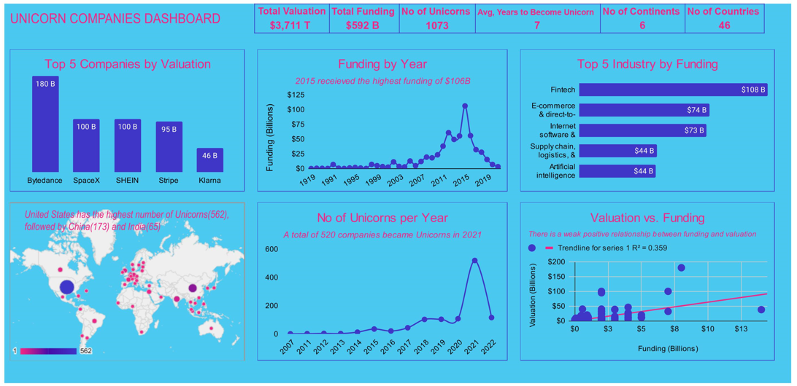

# Analysis-of-Unicorn-Companies

## Introduction

This analysis contains information on Private companies with a valuation over $1 billion as of March 2022, including each company's current valuation, funding, country of origin, industry, select investors, and the years they were founded and became unicorns.

## Problem Statement

1.	Which unicorn companies have had the biggest return on investment?
2.	How long does it usually take for a company to become a unicorn? Has it always been this way?
3.	Which countries have the most unicorns? Are there any cities that appear to be industry hubs?

## Skills and Concepts Demonstrated

- Query function (to get the Top N data)
- Left function to extract the Year column
- Pivot tables (to summarise data)

## Data Sourcing

The data was gotten from the Maven Analytics website which can be accessed [here](https://www.mavenanalytics.io/data-playground?dataStructure=5wfxyeVf1etbP4TXdyPdG1). The data contains 1074 records and 10 columns

## Data Transformation

- The Year Joined column was created to show the year each company become Unicorn 
- Another column named Interval was also created and this was derived by finding the difference between the year founded and the year joined columns to get the number of years it took each company to become a unicorn

## Data Visualization 

You can interact with the full analysis [here](https://docs.google.com/spreadsheets/d/1lMf6fO-I0wSRnZNxi9CHw4g2eNtXyVg02NoVCplMwjE/edit?usp=sharing)

## Insights
- Since Inception till date, a total of $592B has been received as funding
- It took an average of 7 years for companies to become Unicorn 
- Bytedance, SHEIN, SpaceX, Stripe, and Klarna are the companies that have the highest valuation
- The United States accounted for more than half of the Unicorns with 562 companies being Unicorns from the country followed by China and India
- Fintech, E-commerce & direct-to-consumer, Internet software & services, Supply chain, logistics, & delivery, and Artificial intelligence were Industries that received the highest funding
- There was a sporadic increase in the amount of Funding received in 2015
- In 2020, a total of 520 companies which is more than half of all companies became Unicorns

## Conclusion

Overall Unicorn companies have seen an increase in Funding and Valuation in recent years compared to previous years
